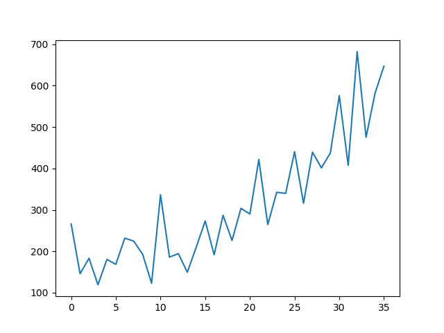

# Time Series Prediction (Not finished)
Simple project for time series prediction with Keras written in Python.

In this small project, I tried to develop a python script to predict universal time series data.
My program reads the data from a csv file and chooses every numerical value as input for the neural network.
For the prediction itself, I used the high-level API Keras based on Tensorflow, developed by Google.

## Dependencies
* keras
* numpy
* csv
* matplotlib

You can install all dependencies via pip like this:
```
pip install keras
```

## Usage
Start the main.py from the terminal and pass in the csv.file:
```
main.py -f data.csv -t true
```
Arguments:
* -f : filename
* -t : wheter the csv-file starts with column titles

## Example
As an example, I use the Shampoo Sales Dataset. You can download it [here](https://raw.githubusercontent.com/jbrownlee/Datasets/master/shampoo.csv).


## TODOs
* prepare data for training (normalization, split in train/test, etc.)
* build RNN (recurrent nerual network) from keras ((maybe try different models))
* train model
* visualize the result